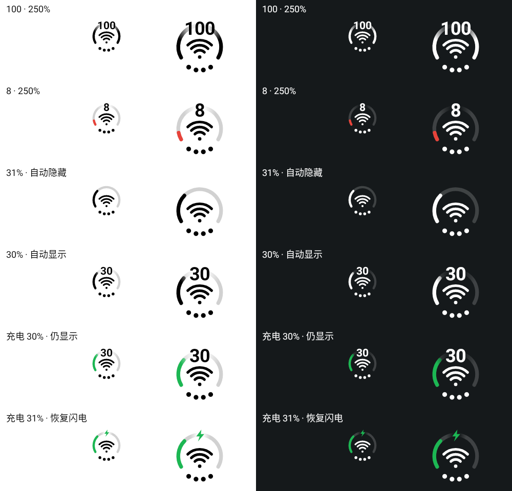
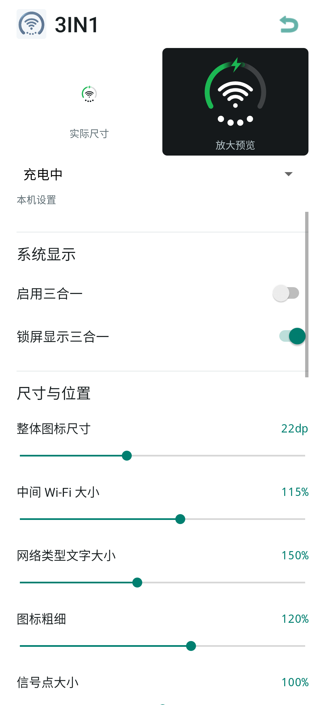

# 3IN1

> **0.1.6 compat 预发布。** 基于 ColorOS 16 机型开发与验证，不是全机型支持声明；其他 Android/ColorOS 版本不作兼容保证。

[下载 APK 与校验文件](https://github.com/FangFangTu150/3IN1/releases/tag/v0.1.6) · [提交问题](https://github.com/FangFangTu150/3IN1/issues) · [安装与恢复](docs/INSTALL.md)

3IN1 是需要 Root/LSPosed（或兼容 legacy Xposed 框架）的 Android 模块，在 SystemUI 原有电池宿主内绘制电量、Wi-Fi 与蜂窝信号组合指示器。

## 范围与边界

- 覆盖状态栏和锁屏；可显示电池环、充电/充满/插电未充电、低电量、省电、Wi-Fi 等级、无互联网/需登录、2G/3G/4G/5G、移动数据关闭、漫游、SIM 异常和飞行模式。
- 不修改 QS（快捷设置）或 AOD，不注入其他应用，不提供遥测、常驻轮询、快充检测或性能模式检测。
- 继承 SystemUI 父级防烧屏移动，但不能保证 OLED 不老化。

## 0.1.6 兼容性范围

| 项目 | 值 |
| --- | --- |
| 开发与验证范围 | ColorOS 16 / Android 16 / API 36 |
| 本次真机验证 | 一加 13 / `PJZ110` / `PJZ110_16.0.10.501(CN01)` |
| 开发与用户测试框架 | LSPosed Irena `1.9.2 (7249)`，API 100（非运行时版本 gate） |
| 作用域 | 仅 `com.android.systemui` |
| legacy Xposed | `minversion 93` |

运行时不再按精确型号、固件构建号或 SystemUI 版本阻断；反射契约不满足或运行时异常时仍会回退原图标。项目仅基于 ColorOS 16 机型开发，其他 Android/ColorOS 版本不作保证；不同 ColorOS 16 机型仍需自行真机验收。

## 配置默认值

设置页共有 19 个持久化参数；越界数值会按实现边界收敛，颜色输入为 `#RRGGBB`。

| 键 | 默认值 | 范围/含义 |
| --- | --- | --- |
| `enabled` | `false` | 启用系统替换 |
| `lockscreen` | `true` | 锁屏显示 |
| `size` | `22dp` | `16-32dp` |
| `wifiScale` | `115%` | `70-150%` |
| `textScale` | `150%` | 网络类型文字 `80-250%` |
| `stroke` | `120%` | `60-160%` |
| `dotScale` | `100%` | 信号点 `60-140%` |
| `dotSpacing` | `100%` | 信号点间距 `70-125%` |
| `horizontalPadding` | `2dp` | `0-8dp` |
| `verticalOffset` | `0dp` | `-4..4dp` |
| `colors` | `true` | 启用状态颜色 |
| `chargingColor` | `#1CB753` | 充电与充满颜色 |
| `lowColor` | `#E7433A` | 电量小于等于低阈值 |
| `saverColor` | `#FFB300` | 省电模式 |
| `lowThreshold` | `20%` | `5-50%`，含等于 |
| `showNumber` | `false` | 始终显示电量数字 |
| `numberScale` | `115%` | `75-250%` |
| `autoNumber` | `false` | 低于或等于阈值自动显示 |
| `numberThreshold` | `20%` | `1-100%`，含等于 |

始终显示优先于自动显示；未知电量不会触发自动显示。有效百分比即使充放电状态为 UNKNOWN 仍可驱动进度和低电量逻辑，但不会伪造充电/充满/暂停标记。

## 证据边界

0.1.6 本地构建、Lint 和 55 项 JUnit/Robolectric 测试通过；一加 13 / `PJZ110` 真机验证已通过，但本地测试不执行真实 ART/Xposed hook，其他机型仍需单独验收。

## 安装与恢复

1. 安装或覆盖 `0.1.6 compat`，不要清除数据。
2. LSPosed 只勾选 `com.android.systemui`，不要选 Android Framework 或所有应用。
3. 启用作用域后重新打开 3IN1，让激活前设置迁移到共享目录；应用默认关闭替换。
4. 重启 SystemUI 或设备，刷新诊断后再启用替换。应用不会自动重启。
5. 异常时先在应用中关闭/恢复原图标；若应用打不开，在 LSPosed 停用 3IN1 后重启。反复崩溃时使用现有 Root/LSPosed 安全恢复流程。

`compat` 是非 debug APK，但使用现有 debug/test 签名以保持测试安装更新兼容；签名密钥不发布，跨签名覆盖安装会失败。

详细文档：

- [安装、更新与恢复](docs/INSTALL.md)
- [功能与设置参数](docs/SETTINGS.md)
- [构建说明](docs/BUILD.md)
- [功能边界与验收状态](docs/COMPATIBILITY.md)
- [0.1.6 候选预发布说明](docs/releases/v0.1.6.md)
- [更新日志](CHANGELOG.md)
- [贡献指南](CONTRIBUTING.md)
- [安全说明](SECURITY.md)

作者：[Coolapk / 17348848](https://www.coolapk.com/u/17348848)

许可证：**暂未指定**。
